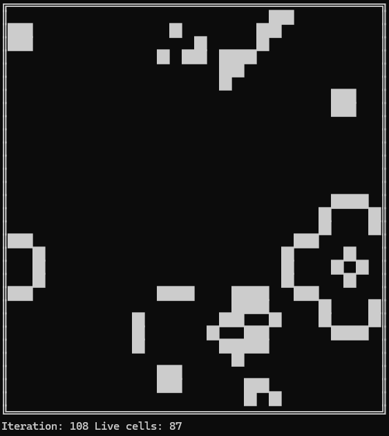

## My recreation of Conway`s Game of Life in Golang

Features: 
- Configurable grid size, tick speed and starting live cells percentage
- Looped-borders grid
- Even cells and pretty borders ✨
- Iterations and number of living cells counters



## Running

1. Download binary from release suitable for your system.
2. Run binary as usual, optionally with flags:  

    Linux:
    ```sh
    ./life -width 50 -height 50
    ```
    Windows:  
    ```powershell
    life.exe -width 60 -start-live 75
    ```
You can view all command line options running binary with ```--help``` flag.

> Warning: if grid width is exceeding terminal size, then grid view starts overlapping with itself and looks ugly. If height is higher than terminal itself, then in-place rendering breaks down and each iteration starts to spam in terminal.

### References

Some of ideas, like using bool slice for grid, certain characters for grid border and cells, i noticed from [pinpox`s implementation of Game of Life ](https://github.com/pinpox/go-game-of-life.git)(until now i didnt realize our repos even named the same). But all functionality and logic(aside from 4 basic rules of game, obviously) i did by myself, honestly!